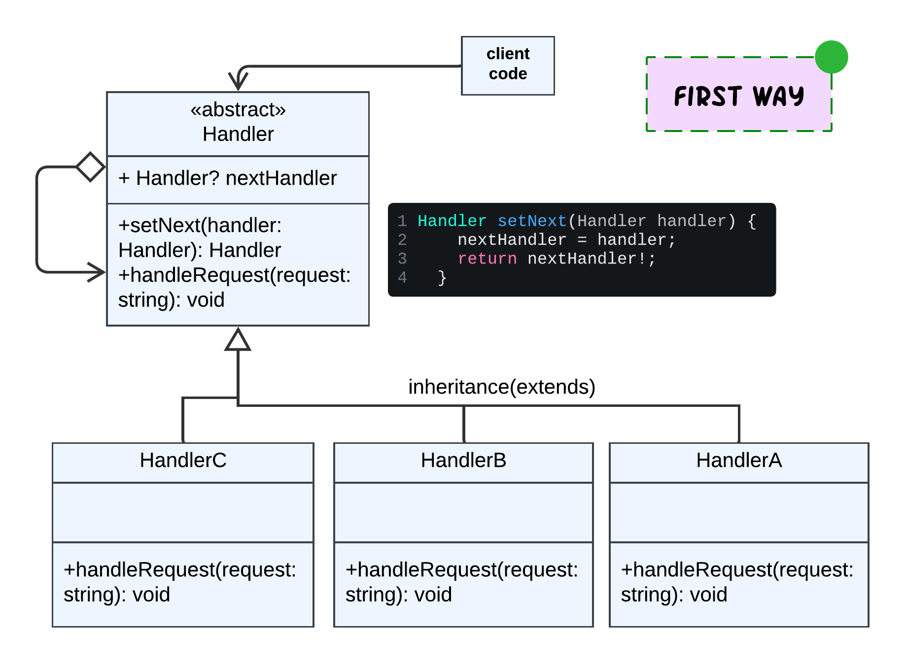
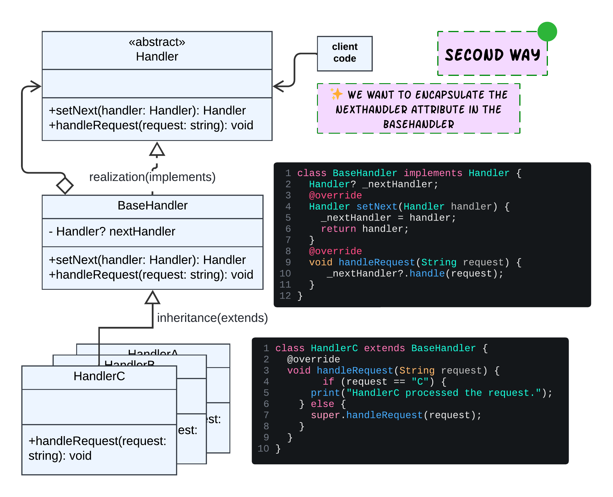
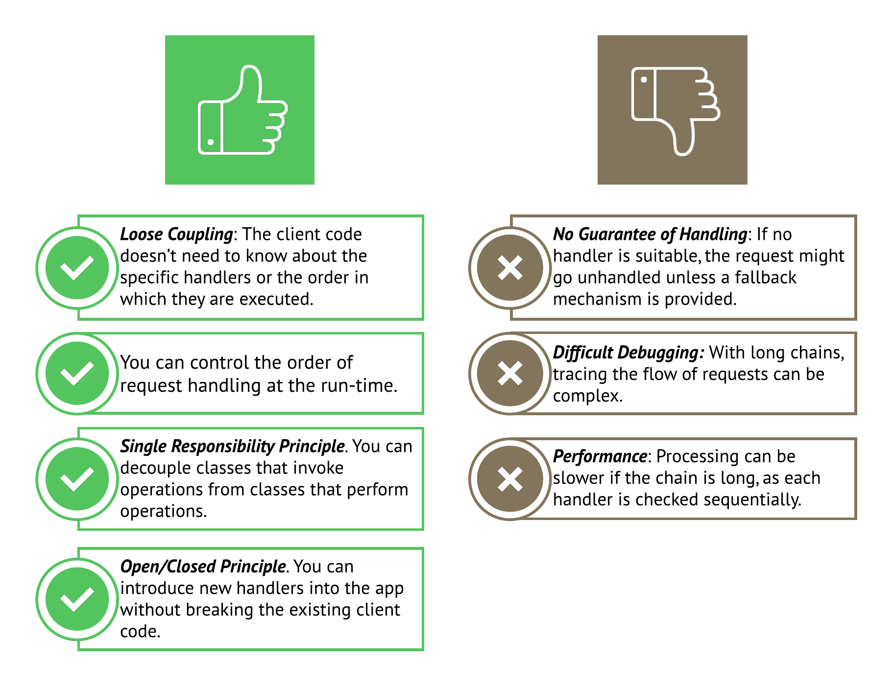

# Chain of Responsibility using Dart

الCOR هو A way of passing a requist between a chain of handlers .

طبعا على حسب ال logic ممكن كل handler ينفذ حاجه على ال request دا و بعدين يبعته للي بعده ، أو ال request يتحرك في ال chain لحد ما handler واحد بس يعمله processing و ال chian تقف لحد كده .

فإحنا نقدر نعتبر الباترن دا كإنه **Linked list** مع **Recursive traversal** .

## The Problem

طبعا كل باترن اتعمل عشان يحل مشكله لما تقابلنا ، ماينفعش استعمل باترن لمجرد اني عارف استخدمه و خلاص لإن دا كده هيخلي ال system بتاعي complex اكتر، و هكون كده بعمل **Overengineering**.

دا كود بسيط عشان نفهم المشكله الي بيحلها ال Chain of Responsibility :

```dart
void handleRequest(String request) {
  if (request == "A") {
    print("HandlerA processed the request.");
  } else if (request == "B") {
    print("HandlerB processed the request.");
  } else if (request == "C") {
    //we have 2 steps of handling here.
    print("HandlerC processed the request.");
    //plus the same logic of handlerA 👇
    //code duplication 🙄
    print("HandlerA processed the request.");
  } else {
    print("The request left untouched.");
  }
}

void main() {
  handleRequest("A"); // Output: HandlerA processed the request.
  handleRequest("B"); // Output: HandlerB processed the request.
  handleRequest("C"); // Output: HandlerC processed the request.
  handleRequest("D"); // Output: The request left untouched.
}
```

1. الlogic كله معموله **Centralization** في مكان واحد، معنى كده ان اي تعديل في طريقه ال processing لأي condition، هتخليني اضطر كل شويا اعدل في الكود دا ، اذا بيخالف ال OCP و SRP.
2. في ال condition C لاحظ اني احتاجت اكرر نفس الكود الي كان موجود في ال Condtion A، فا في عندي Code Duplication معناها ان الكود دا مش Clean Code، بيخالف ال DRY (Don't Repeat Yourself)

طيب الحل ايه؟

<div dir="rtl" style="border:1px solid gray; padding:10px; border-radius:5px;">
  لو تلاحظ انا ببعت Request،عند كل if statement بتشيك هل هقدر اعمل processing ولا لا ، لو عملت processing ال if-else statement هتقف، طيب لو معرفتش اعمل processing هبعته للي بعدي، هو دا بالظبط ال Chain of Responsibility.

فأنا بس هغير طريقه كتابتي للكود عشان احافظ عل ال SOLID , اخلي الكود Clean أكتر.

</div>

---

# Solution 1️⃣



```dart
// Abstract handler
abstract class Handler {
  Handler? nextHandler;

  Handler setNext(Handler handler) {
    nextHandler = handler;
    return nextHandler!;
  }

  void handle(String request);
}
```

ليه ال nextHandler نوعه nullable ؟ لإن آخر concrete handler في ال chain طبيعي مايكونش بيشاور على حاجه.

بعد كده كريت ال concrete handlers لكل logic معين

```dart
// Concrete handler for request type "A"
class HandlerA extends Handler {
  @override
  void handle(String request) {
    if (request == "A") {
      print("HandlerA processed the request.");
    } else if (nextHandler != null) {
      nextHandler!.handle(request);
    } else {
      print('the request left untouched.');
    }
  }
}
```

بعد كده في ال main function

- بكريت object لكل concrete class.
- برتب ال chain زي ما أنا عايزه.
- الclient code دايما بيبعت ال request لاول object في ال chain، مالوش علاقه و مش مهتم يعرف مين الي عمل Processing لل request ، المهم انه اتعمله Processing.

```dart
void main() {
  final Handler handlerA = HandlerA();
  final Handler handlerB = HandlerB();
  final Handler handlerC = HandlerC();

  // Setting up the chain a > b > c
  handlerA.setNext(handlerB).setNext(handlerC);
  //updating the chain b > a > c
  // handlerA.setNext(handlerC);
  // handlerB.setNext(handlerA);

  // Making requests at the first node of the chain.
  handlerA.nextHandler; //we can access the next handler because it is public , and there is no encapsulation for nextHandler.

  // Client code starts from here
  handlerA.handle("A"); // Output: HandlerA processed the request.
  handlerA.handle("B"); // Output: HandlerB processed the request.
  handlerA.handle("C"); // Output: HandlerC processed the request.
  //👇 No output, as no handler could process the request,the request left untouched.
  handlerA.handle("D");
}
```

# Solution 2️⃣



الفرق الوحيد اني عايزه اعمل Encapsulation for nextHandler attribute, واخليه Private بالنسبه لأي files تانيه لو انا محتاجه دا.

```dart

abstract class Handler {

  Handler setNext(Handler handler);

  String handle(String request);
}

class BaseHandler implements Handler {
  //to encapsulate the _nextHandler in one class
  Handler? _nextHandler;//private for other files

  @override
  Handler setNext(Handler handler) {
    _nextHandler = handler;
    return handler;
  }

  @override
  String handle(String request) {
    return _nextHandler?.handle(request) ?? '';
  }
}

class HandlerA extends BaseHandler {
  @override
  String handle(String request) {
    if (request == "A") {
      return "HandlerA processed the request.";
    }  else {
      return super.handle(request);
    }
  }
}
```

طرق ال Implementation لأي باترن بتخلف على حسب:

- ال logic ال عايز تحققه
- ال SOLID principles الي عايز تحافظ عليها
- الطريقه الي بترييحك في كتابه الكود

# Pros and cons



# 🧾 Conclusion

إذن إمتى المفروض استعمل الباترن دا ؟

- لما يكون عندي اكثر من Handler for the Client Request ( بس خلال ال run-time ال client code مش مهتم يعرف مين ال عمل handling لل request بتاعه)
- لما ال request يكون المفروض يتعمله Processing by secific order.
- لما أكون عايز اقدر اغير ترتيب ال chain و اضيف عليها من غير ما أعمل Breaking changes.
- لما اكون عايز اعمل Decoupling بين ال client code(sender) و ال handlers(reciever).
- عايز اتخلص من ال centralization و ال Complex if-else statement.
