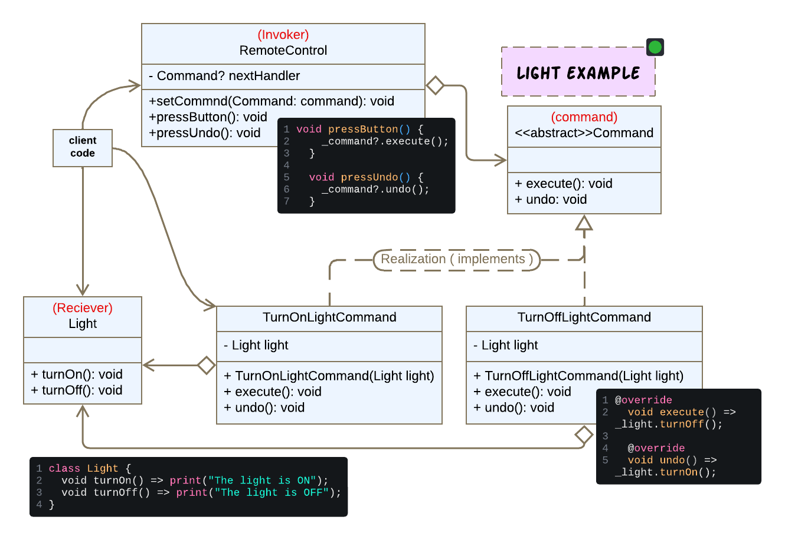
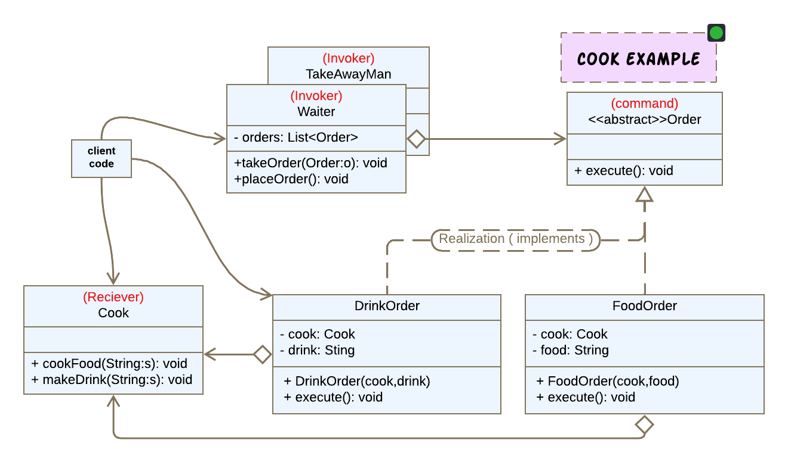
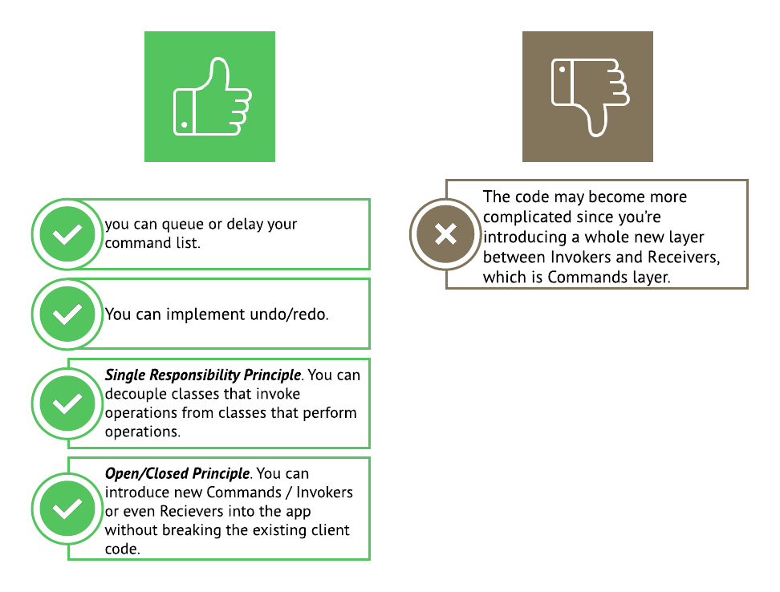

# Command Pattern using Dart

الCommand هو behavioral pattern that turns a request into a stand-alone object that contains all information about the request. This transformation lets you pass requests as a method arguments, delay or queue a request’s execution, and support undoable operations. .

الطريقه دي بقا بتسمحلي اني أخزن الRequests دا في Queue عشان انفذه بعدين او اعمله delay، و أقدر أبعته كا argument ل method لإنه عباره عن اوبجكت مستقل بذاته بيحتوى عللى المعلومات الخاصه بالركويست دا بس ، و أقدر اعمل undo/redo functionality.

ال **Command Pattern** سعات ممكن نسميه **Action Pattern** او **Transaction Pattern**.

## Problem 1️⃣

دا كود بسيط عشان نفهم المشكله الي بيحلها ال Command Pattern :

```dart
class Light {
  void turnOn() => print("The light is ON");
  void turnOff() => print("The light is OFF");
}

// Invoker class
// the remote control is tight coupled with the light and it functionality
// we can not use this remote controll for any other device.
// if we have another device that is supposed to turn the light on and off,
// we have to repeate the remote control code.
class RemoteControl {
  final Light _light;

  RemoteControl(this._light);

  void pressOnButton() {
    _light.turnOn();
  }

  void pressOffButton() {
    _light.turnOff();
  }
}

// Usage example
void main() {
  Light light = Light();
  RemoteControl lightRemoteControl = RemoteControl(light);

  lightRemoteControl.pressOnButton(); // Output: The light is ON

  lightRemoteControl.pressOffButton(); // Output: The light is OFF
}
```

1. The RemoteControl is tight coupled with the Light and it functionality، يعني أي تعديل في ال Light class لو مثلا عايزه اضيف Functionality زياده زي اني اتحكم في الbrightness level هضطر اضيف Function زياده في ال RemoteControl او اعدل في ال pressOnButton() لاني مش هعمل on مره واحده لا في اكتر من Level.

2. طيب لو عايزه استخدم الريموت كنترول دا لأكتر من جهاز تاني الكود هيكون complex اكتر. فا هضطر اعمل ريموت كونترول تاني مختلف بيتعامل مع الجهاز الجديد. رغم انه ممكن يكون نفس ال Structure بتاع RemoteControl class.

كل دا معناه ان الكود دا بي violate مبدأ ال DIP.

طيب الحل ايه؟

انا لو قريت الكود كويس هقدر اطلع منه ثلاث مكونات أساسيه:

- أولا عندي **Invoker Class** و هو المسؤول انه يبعت إشاره عشان الامر يتنفذ، لاكن المفروض انه مايعرفش الامر دا هيتنفذ إزاي و لا مين الي مفروض ينفذه، في حالتنا دي المفروض يبقى الريموت كونترول.
- ثانيا عندي ال **Command Class** ، وهو الي بيكون شايل الداتا الخاصه بالأمر دا و عارف مين الي هينفذه و في حالتنا دي هو هيكون أمر ال Turn on و أمر ال Turn off، و الأمرين دول خاصيين بال Light device.
- ثالثا ال Device نفسه الي عارف طريقه تنفيذ الأمر بالظبط و جواه ال Actual logic، وبنسميه ال **Reciever Class** و في حالتنا دي هي ال Light device أكيد.

أي كود اقدر اقسمه ل **Invoker** و **Command**و **Reciever** إذن الافضل اني اطبق الباترن دا.

---

# Solution 1️⃣


ال Reciver Class جواه ال Actual logic.

```dart
// Receiver class
class Light {
  void turnOn() => print("The light is ON");
  void turnOff() => print("The light is OFF");
}
```

بما اني عندي اكتر من Command فاعملنا Abstract class كلهم يعملوله implementation.

```dart
// Step 1: Define the Command interface
abstract class Command {
  void execute();
  void undo(); // Optional, if undo functionality is needed
}

// Step 2: Implement concrete commands
class TurnOnLightCommand implements Command {
  final Light _light;

  TurnOnLightCommand(this._light);

  @override
  void execute() => _light.turnOn();

  @override
  void undo() => _light.turnOff();
}

class TurnOffLightCommand implements Command {
  final Light _light;

  TurnOffLightCommand(this._light);

  @override
  void execute() => _light.turnOff();

  @override
  void undo() => _light.turnOn();
}
```

الريموت كونترول دلوقتي بيتعامل ال Commands بس، اذن ممكن استعمله لأكتر من جهاز تاني .

```Dart
// Step 3: Invoker class
class RemoteControl {
  Command? _command;

  void setCommand(Command command) {
    _command = command;
  }

  void pressButton() {
    _command?.execute();
  }

  void pressUndo() {
    _command?.undo();
  }
}
```

بعد كده في ال main function:

- بكريت ال Reciver object بتاعي.
- بكريت ال command objects و احدد كل command شغال على انهي reciever(device) في حالتنا ما عندناش غير Light Device بس.
- بكريت ال Invoker object ، الي هينفع يشتغل مع أي reciever لإنه ليه علاقه بالأوامر بس، انه يبعت اشاره فقط لا غير.

خد بالك مش شرط يكون عندي reciver واحد او Invoker واحد ،الكود ممكن يكون فيه اكتر من Reciever او اكتر من Invoker على حسب ال logic الي بنعمله implementation 👀

```Dart
// Usage example
void main() {
  //reciver
  Light light = Light();
  //commands
  Command turnOnCommand = TurnOnLightCommand(light);
  Command turnOffCommand = TurnOffLightCommand(light);
  //invoker
  var remoteControl = RemoteControl();

  // Turn on the light
  remoteControl.setCommand(turnOnCommand);
  remoteControl.pressButton(); // Output: The light is ON

  // Turn off the light
  remoteControl.setCommand(turnOffCommand);
  remoteControl.pressButton(); // Output: The light is OFF

  // Undo the last command
  remoteControl.pressUndo(); // Output: The light is ON
}

```

---

## Problem 2️⃣

عندي شيف شغال في المطبخ ، و ويتر بيجمع الطلبات بعدين يبعتها للشيف، الطلبات ممكن تكون مشاريب او أطعمة.
اقرأ الكود و جرب تعمله Run ، فكر كده ايه الي ممكن يحصل لو عندي اكتر من شيف او اكثر من ويتر؟

```dart
class Cook {
  void cookFood(String food) {
    print("Cooking $food...");
  }

  void makeDrink(String drink) {
    print("making $drink...");
  }
}

class Waiter {
  final List<String> _foodOrders = [];
  final List<String> _drinkOrders = [];
  final Cook _cook;

  Waiter(this._cook);

  void takeFoodOrder(String food) {
    _foodOrders.add(food);
    print("Food order for $food taken.");
  }

  void takeDrinkOrder(String drink) {
    _drinkOrders.add(drink);
    print("Drink order for $drink taken.");
  }

  void placeOrders() {
    for (var food in _foodOrders) {
      _cook.cookFood(food);
    }
    for (var drink in _drinkOrders) {
      _cook.makeDrink(drink);
    }
    _foodOrders.clear();
    _drinkOrders.clear();
  }
}

// Client code
void main() {
  var cook = Cook();

  var waiter = Waiter(cook); // the Cook is Tight Coupling with Waiter.

  waiter.takeFoodOrder("Burger"); //output: Food order for Burger taken.
  waiter.takeFoodOrder("Pizza"); //output: Food order for Pizza taken.
  waiter.takeDrinkOrder("Tea"); //output: Drink order for Tea taken.
  waiter.takeDrinkOrder(
      "Apple Juice"); //output: Drink order for Apple Juice taken.

  waiter.placeOrders();
  /*
  output:
    Cooking Burger...
    Cooking Pizza...
    making Tea...
    making Apple Juice...
  */
}

```

نفس المشكله عندي ال Waiter Class هيكون Tightly coupled لي ال Cook Class.
الويتر الواحد هياخد الطلبات و يشتغل مع شيف واحد بس. لو عايز اضيف اكتر من شيف كل شيف شغال على جزء معين في المطبخ او اكتر من ويتر شغالين في الصاله و كل واحد فيهم بياخد اكتر من طلب ، الكود دا مش مناسب خالص اني اعمله extend على ال Scale الكبير دا ، خصوصا ان الطلبات بتتاخد مره واحده و ممكن تتخزن فتره و لو بسيطه و بعدين تتبعت للمطبخ 🙄
بردو عندي Violation لل Dependency inversion principle.

---

# Solution 2️⃣



ممكن اعمل Abstract class for the Invoker and Reciever على حسب الحاجه، عندي Waiter, TakeAwayMan الاتنين عباره عن Invoker كل واحد فيهم بياخد اكتر من اوردر و يبعته للشيف، ممكن يكونوا شغالين مع أكتر من شيف مش لازم يكونوا Tightly coupled for one Cook.

- الشيف هو الوحيد الي عارف طريقه الطبخ و التنفيذ.

```dart
// Receiver class
class Cook {
  void cookFood(String food) {
    print("Cooking $food...");
  }

  void makeDrink(String drink) {
    print("making $drink...");
  }
}
```

- كل اوردر بيحتوي على الداتا الخاصه بيه و مين الشيف الي هينفذه ، من غير ما يعرف هينفذه إزاي.

```dart
// Command interface
abstract class Order {
  void execute();
}

// Concrete Command class
class FoodOrder implements Order {
  final Cook _cook;
  final String _food;

  FoodOrder(this._cook, this._food);

  @override
  void execute() {
    _cook.cookFood(_food);
  }
}

class DrinkOrder implements Order {
  final Cook _cook;
  final String _drink;

  DrinkOrder(this._cook, this._drink);

  @override
  void execute() {
    _cook.makeDrink(_drink);
  }
}
```

- ال Waiter و ال Take away man كل واحد فيهم بياخد اكتر من اوردر و ويبعته للمطبخ ، مش مهم يعرف مين الشيف المتخصص الي بينفذ الاوردر ولا حتى طريقه تنفيذه عاملع ازاي، مهمته يبعت الطلبات بس.

```dart
// Invoker class
class Waiter {
  // we can queue the orders, and process them later.
  final List<Order> _orders = [];

  //set commands
  void takeOrder(Order order) {
    _orders.add(order);
    print("Order taken in the resturant");
  }

  void placeOrders() {
    for (var order in _orders) {
      order.execute();
    }
    _orders.clear();
  }
}

// another Invoker class
class TakeAwayMan {
  final List<Order> _orders = [];

  //set commands
  void takeOrder(Order order) {
    _orders.add(order);
    print("Order taken from a window");
  }

  void placeOrders() {
    //imagin that this is a different imaplementation.
    for (var order in _orders) {
      order.execute();
    }
    _orders.clear();
  }
}
```

- بعد كده عندي ال main function الي فيها كل الكود الي فات دا بيتكلم مع بعضه 😁

```Dart
// Client code
void main() {
  // Receiver
  var cook = Cook();
  /* you can add different cooks,
  each one cooks with his own way.👍
  abstraction + polymorphism
  same thing for the Invoker.
  */

  // Commands
  var burgerOrder = FoodOrder(cook, "Burger");
  var pizzaOrder = FoodOrder(cook, "Pizza");
  var tea = DrinkOrder(cook, "tea");
  var appleJuice = DrinkOrder(cook, "apple juice");

  // Invoker
  var waiter = Waiter();
  var takeAwayMan = TakeAwayMan();

  // Client places orders
  waiter.takeOrder(burgerOrder);
  waiter.takeOrder(pizzaOrder);
  waiter.takeOrder(tea);
  waiter.takeOrder(appleJuice); //output: Order taken in the resturant
  takeAwayMan.takeOrder(pizzaOrder); //output: Order taken from a window

  // Orders are processed
  waiter.placeOrders();
  /*
  output:
  Cooking Burger...
  Cooking Pizza...
  making tea...
  making apple juice...
  */
  takeAwayMan.placeOrders(); // output: Cooking Pizza...
  }
```

# Pros and cons



# 🧾 Conclusion

إذن إمتى المفروض استعمل الباترن دا ؟

- لما يكون عندي أوامر عايز اخزنها وانفذها بعدين (Delayed Queue).
- لو عايز اطبق Undo/Redo Funcionality.
- لو عايز اعمل support for macro commands، الي هي اكتر من امر بيتنفذوا كا Single Unit.
- لو عايز افصل بين الكلاس الي بي Perform the operation و ال كلاس الي بي Invoke the same operation (Decoupling).
