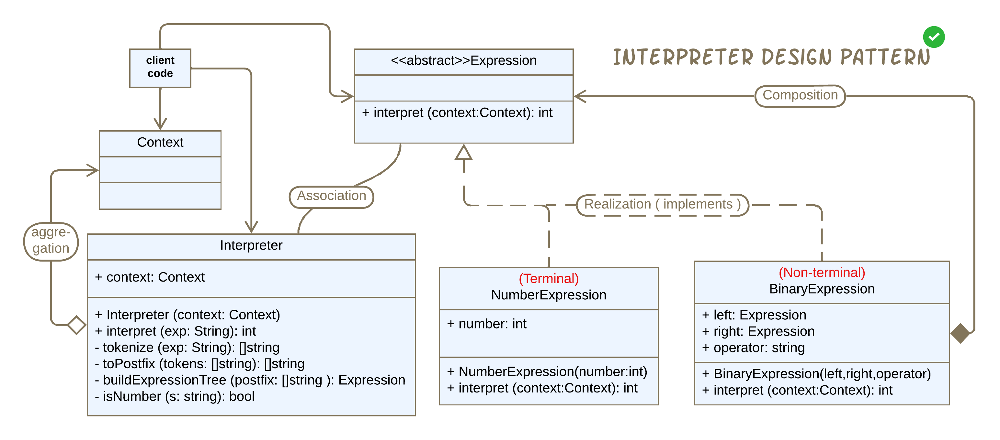
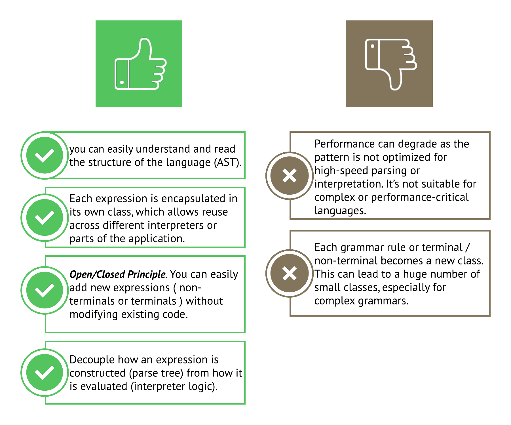

# Interpreter using Dart

الInterpreter هو

behavioral design pattern used to define a language's grammar and provide an interpreter to process statements in that language.

طيب يعني إيه الكلام دا؟ بإختصار شديد هو زي المترجم بالظبط عارف قواعد لغه و لتكن إيطالي مثلا، ولما بتجيله جمله:

1. بيقسمها لكلمات (أصغر وحده مفهومه في اللغه)
2. بيحدد كل كلمه عباره عن verb/noun/...etc.
3. بيفهم و يكون structure الجمله
4. بيطبق القواعد الي عارفها قبل كده في انه يترجم الجمله

الخطوات دي كلها بتحصل بصوره بديهيه، ولكن عشان نعمل Implement للباترن دا كان لازم نقسم المنطق دا خطوه خطوه.

## The Problem

احنا محتاجين الباترن دا ليه؟؟

تخيل انك بتعمل آله حاسبه بسيطه ، بتاخد رقمين و بتجمعهم او بتطرحهم، تمام

إذن الكود هيكون عباره عن if-else statement، بناءا على نوع العمليه الحسابيه الي انت اختارتها.

طيب لو عايز تطور الاله الحاسبه دي شويا، و عايزها تاخد اي عدد من الارقم و كذا عمليه حسابيه في نفس الوقت مع بعض، زي الامثله دي مثلا:

1. **Factorial of a Large Number**

   $$
   100! = 100 \times 99 \times 98 \times \ldots \times 1
   $$

2. **Exponentiation with Large Numbers**

   $$
   2^{1000}
   $$

3. **Combinations and Permutations**

   $$
   \binom{1000}{500} = \frac{1000!}{500! \cdot 500!}
   $$

4. **Large Summation**

   $$
   \sum_{k=1}^{1,000,000} k = \frac{1,000,000 \cdot (1,000,000 + 1)}{2} = 500,000,500,000
   $$

5. **Nested Roots and Powers**

   $$
   \sqrt{(2^{64} + 1)^2 + 1}
   $$

6. **Modular Exponentiation in Cryptography**
   $$
   7^{123456789} \mod 1000000007
   $$

و أمثله تانيه كتير جدا، هتلاقي ان ال if-else statement بتاعتك بتكبر جدا و كل شويا بتعدل عليها على حسب انت معاك كام operand و ايه انواع ال operations الموجوده في المسأله. إذن فكره ال if-else statement دي مستحيل تكون عمليه 🙄

كده عرفنا المشكله، لو فكرنا في الحل شويا هلاقي ان ال math دي كإنها لغه، كل المسائل المعقده و الطويله دي أساسها عمليات حسابيه بسيطه زي الجمع و الطرح، إذن انا لو عرفت قواعد اللغه دي اقدر استخدم نفس القاعده اكتر من مره عشان اكون عمليات حسابيه معقده.

- ابسط حاجه في اللغه دي هي ال numbers ( الوحده الي ماينفعش تتجزأ لحاجه أصغر، بنسميها في الباترن دا **terminal expression**).
- تاني حاجه العمليات الحسابيه على رقمين، و دي بتاخد First expression و Second expression و العمليه الحسابيه الي هتنفذها عليهم ( عشان كده بنسميها **non-terminal expression** ).

**أساس تنفيذ الباترن دا هو ال recursion** 😀

---

# Solution



عشان اعمل implementation للباترن دا للباترن دا لاوم افهم مكوناته الأساسيه عشان اعرف استخدمها بالطريقه الي تناسب المشكله الي عندي.

1. ال **Context**: دا بيكون فيه أي معلومات ال interpreter ممكن يحتاجها خلال عمليه الترجمه، السياق بمعنى أصح، يعني مثلا لو انت بترجم جمله انجليزي، لو الجمله اتقالت والشخص سعيد ترجمتها هتكون مختلفه عن لو الشخص كان بيقولها و هو بيتخانق مثلا او بيهدد حد. فا ال Interpreter بيعرف المعلومات دي من ال context class.
   **طبعا احنا محتاجين نغير اسم ال class دا لو بكتبه جوا Flutter app.**

2. ال **Abstract Expression**: بعرف فيه ال method الي هتعمل interpret.

3. ال **Terminal Expression**: هو وحده البناء الأساسيه للغه.

4. ال **Non-terminal Expression**: هو expression بيكون متكون من أكتر من expression تاني ،عشان كده بنسميه Composite expression.

5. ال **Interpreter**: هو دا الي بيفهم ال text الي داخل له ، في نطاق ال context ، و بينفد عمله الترجمه ، و بيرجعلي ال result.

6. ال **Client code**: المكان الي باخد منه ال input الي ال Interpreter هيترجمه، ممكن يكون text و أعمله parsing ل Abstract Syntax Tree (AST)، ممكن ال parsing دا يتم في ال client code او في interpreter.

# Implementaion

- ال **Context** بتاعنا بالنسبه لي ال logic بتاع الآله الحاسبه مش محتاجين فيه أي حاجه.

```dart
class Context {
  // Any global information needed for interpretation
  // This can be extended to hold variables, functions, etc.
  // For simplicity, we are not using it in this example.
  // in our case we don't need any global context.
}
```

- بعرف ال Expression و بعمل implement لل concrete classes.

```dart
// Expression interface
abstract class Expression {
  int interpret(Context context);
}

// Number expression (terminal expression)
class NumberExpression implements Expression {
  final int number;

  NumberExpression(this.number);

  @override
  int interpret(Context context) => number;
}

// Binary expression with support for +, -, *, /, ^ (non-terminal expression)
class BinaryExpression implements Expression {
  final Expression left;
  final Expression right;
  final String operator;

  BinaryExpression(this.left, this.right, this.operator);

  @override
  int interpret(Context context) {
    switch (operator) {
      case '+':
        return left.interpret(context) + right.interpret(context);
      case '-':
        return left.interpret(context) - right.interpret(context);
      case '*':
        return left.interpret(context) * right.interpret(context);
      case '/':
        return left.interpret(context) ~/ right.interpret(context);
      case '^':
        return pow(left.interpret(context), right.interpret(context)).toInt();
      default:
        throw UnsupportedError('Unknown operator: $operator');
    }
  }
}
```

- ال **Interpreter** بياخد ال string الي ال user كتبه و هينفذ عليه اكتر من خطوه عشان يوصل للناتج النهائي، بيكون واخد في اعتباره ال context الي ال string اتقال او اتكتب فيه، في حالتنا ال context فاضي بس حبيت اوضحه لإن ممكن تستخدمه في problem تانيه.

```dart
class Interpreter {
  final Context context;

  Interpreter(this.context);

  int interpret(String expression) {
    // 1>> this is parsing the expression into tokens.
    final List<String> tokens = _tokenize(expression);

    // 2>> this is converting infix to postfix notation (Shunting Yard Algorithm).
    final List<String> postfix = _toPostfix(tokens);

    // 3>> this is building the expression tree from postfix notation.
    final Expression tree = _buildExpressionTree(postfix);

    // 4>> this is evaluating the expression tree & returning the final result.
    return tree.interpret(context);
  }

  //List<String> _tokenize(String expression) {...

  //List<String> _toPostfix(List<String> tokens) {...

  //Expression _buildExpressionTree(List<String> postfix) {...

  //bool _isNumber(String s) => int.tryParse(s) != null; //we need this in many places.
}
```

### Interperter Steps:

- تعالى نتكلم عن خطوات ال Interperter بقا😁، دي حاجه بتختلف على حسب ال problem اي بتحلها يعني مالهاش علاقه بالباترن نفسه.

1. الميثود دي بتقسم ال string ل tokens و بتحطهم في list، يعني لو مثلا دا ال string الي ال user دخله
   ' 22 + ( 10 /3 ) ' ، فأنا عندي ال 22 دي عباره عن token لوحدها رغم انها مكونه من خانتين، و ال 3 دي token بردو بس مكون من خانه واحده ، و الجمع و القسمه و الأقواس كل حاجه فيهم عباره عن token. و بتأكد ان ال token ماينفعش يكون empty string.

```Dart
  // Tokenizer, becuase we may have number with multiple digits.
  List<String> _tokenize(String expression) {
    final List<String> tokens = [];
    final StringBuffer buffer = StringBuffer();

    for (int i = 0; i < expression.length; i++) {
      final char = expression[i];
      if ('0123456789'.contains(char)) {
        buffer.write(char);
      } else {
        if (buffer.isNotEmpty) {
          tokens.add(buffer.toString());
          buffer.clear();
        }
        if ('+-*/^()'.contains(char)) {
          tokens.add(char);
        }
      }
    }
    if (buffer.isNotEmpty) {
      tokens.add(buffer.toString());
      buffer.clear();
    }
    return tokens;
  }
```

2. بعد ما كونت list من ال tokens، بحول ال **Infix notation** (3 + 4 _ 2) دا ل **Postfix notation** (3 4 2 _ +) عن طريق ال **Shunting Yard Algorithm**

   - عندي Operator Stack بخزن فيه العمليات الحسابيه مؤقتا.
   - و Output Queue هيكون فيه النتيجه النهائيه لل postfix notation.

A. بعمل Loop عشان اعدي على كل tokens.

B. لو كان ال token عباره عن رقم بضيفه على طول في Output queue.

C. لو ال token كان عمليه حسابيه ، لو ال stack مافيش فيه أي عمليه ليها اولويه أعلى إذن بضيف ال token دا في ال stack على طول. لو الشرط دا ما اتحققش حطلع الي موجود على وش ال stack و أضيفه في ال queue و بعدين ال token اي معايا أضيفه في ال stack عادي ، بس بعد ما إتأكدت ان ما فيش حاجه في ال stack ليها أولويه اعلى منه .

D. لو كان ال token قوس فتح ، هضيفه في ال stack على طول.

E. طيب لو كان ال token عباره عن قوس غلق، إذن هطلع كل حاجه من ال stack و اضيفها في ال queue ، لحد ما أقابل قوس الفتح و أعمله discard

F. بعد ما لفيت على كل ال tokens لو لسا في حاجه في ال stack بضيفها في ال queue.

[](https://www.youtube.com/watch?v=Wz85Hiwi5MY)

```Dart
  // Convert infix to postfix using (Shunting Yard Algorithm).
  List<String> _toPostfix(List<String> tokens) {
    final output = <String>[];
    final operators = <String>[];

    final precedence = {'+': 1, '-': 1, '*': 2, '/': 2, '^': 3};
    final rightAssociative = {'^'};

    for (final token in tokens) {
      if (_isNumber(token)) {
        output.add(token);
      } else if ('+-*/^'.contains(token)) {
        while (
            // ---> 1
            operators.isNotEmpty &&
                // ---> 2
                operators.last != '(' &&
                // ---> 3
                (precedence[operators.last]! > precedence[token]! ||
                    (precedence[operators.last]! == precedence[token]! &&
                        !rightAssociative.contains(token)))
            //
            ) {
          output.add(operators.removeLast());
        }
        operators.add(token);
      } else if (token == '(') {
        operators.add(token);
      } else if (token == ')') {
        while (operators.isNotEmpty && operators.last != '(') {
          output.add(operators.removeLast());
        }
        if (operators.isEmpty || operators.last != '(') {
          throw FormatException('Mismatched parentheses');
        }
        operators.removeLast(); // remove '('
      }
    }

    while (operators.isNotEmpty) {
      if (operators.last == '(') {
        throw FormatException('Mismatched parentheses');
      }
      output.add(operators.removeLast());
    }
    return output;
  }
```

3. بحول ال postfix notation الي طلعته ل Abstract Syntax tree، في الآخر ال stack بيكون فيه Expression واحد بس، و هو دا الي هيتعمله inerpret في الآخر عن طريق traversing & evaluating the AST.

[](https://www.youtube.com/watch?v=PkKLTiEOpyw)

```Dart
  // Build expression tree from postfix
  Expression _buildExpressionTree(List<String> postfix) {
    final List<Expression> stack = [];

    for (final token in postfix) {
      if (_isNumber(token)) {
        stack.add(NumberExpression(int.parse(token)));
      } else if ('+-*/^'.contains(token)) {
        final right = stack.removeLast();
        final left = stack.removeLast();
        stack.add(BinaryExpression(left, right, token));
      }
    }
    //Checks that this iterable has only one element, and returns that element.
    return stack.single;
  }
```

- اخر حاجه عندي ال Client code, و هو الي انا بكريت فيه ال objects الي محتاجها و باخد ال input من ال user عشان اعمله interpret.

```Dart
// Client
void main() {
  final context = Context();
  final interpreter = Interpreter(context);

  final expressions = [
    '2^3',
    '2^3^2', // right-associative: 2^(3^2) = 2^9 = 512
    '3+(5*2)^2', // 3 + (10)^2 = 3 + 100 = 103
    '4+2^2*3', // 4 + 4*3 = 4 + 12 = 16
    '(2+3)^2', // 5^2 = 25
  ];

  for (final expr in expressions) {
    try {
      final result = interpreter.interpret(expr.replaceAll(' ', ''));
      print('Result of "$expr" = $result');
    } catch (e) {
      print('Error evaluating "$expr": $e');
    }
  }
}
```

- اتكلنا في الكود دا عن **Interpreter Pattern**, **Shunting Yard Algorithm** , **AST Data Structure** و استخدمناهم مع بعض عشان اعمل Extendable calculation program.

# Pros and cons



# 🧾 Conclusion

إذن إمتى المفروض استعمل الباترن دا ؟

- لو بتعامل مع Domain Specific Language (DSL)، ليها قواعد معينه.
- لو بحتاج اضيف كل فتره قاعده جديده فهكون محتاجه الكود يكون extendable.
- لو عايزه اغطي كل الإحتمالات الي ممكن ال user يطلب يترجمها ، بدون ما يكون عندي if-else statements كتيره جدا، لإني هقدر اركب أكتر من قاعده فوق بعض و أستخدها بشكل متكرر.
