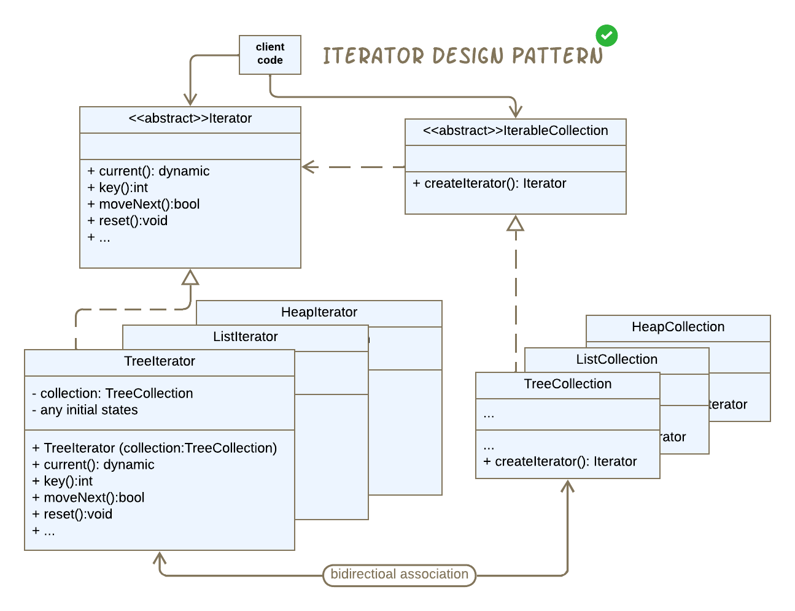
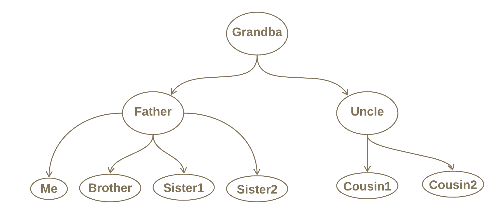
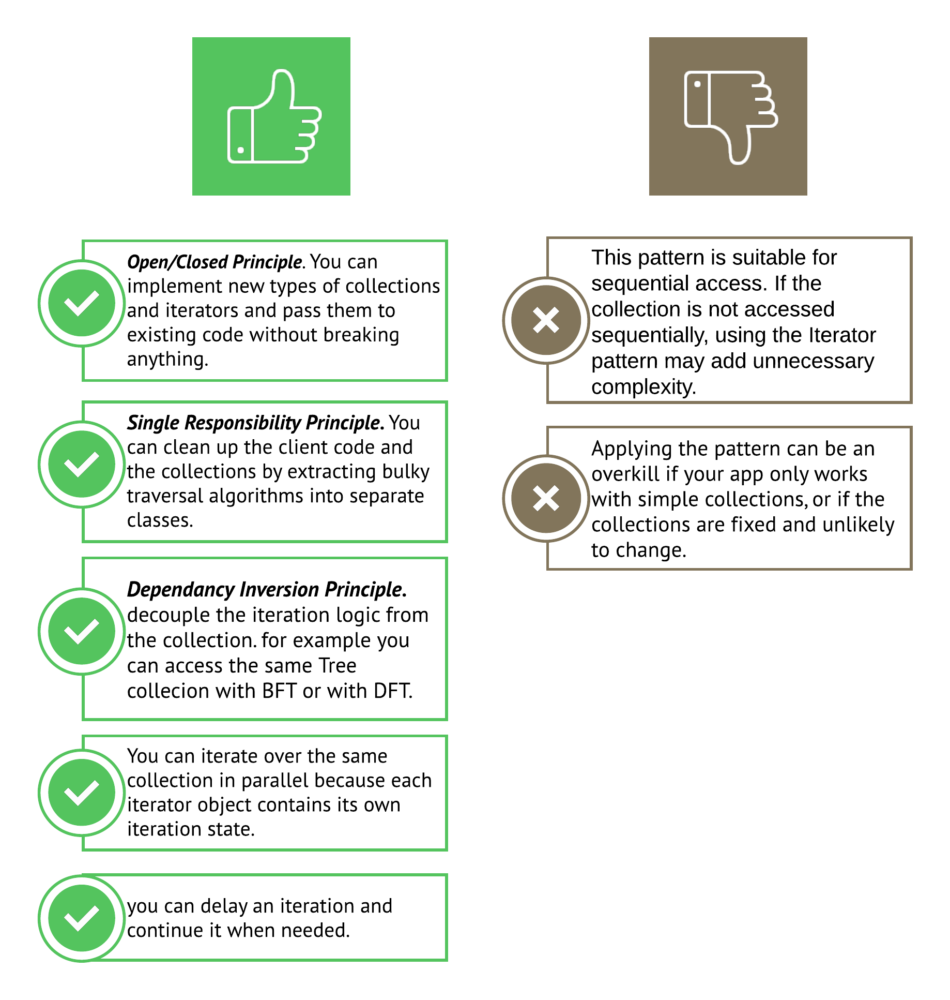

# Iterator using Dart

الIterator هو

behavioral design pattern that lets you traverse elements of a collection **sequentially** without exposing its underlying representation.

يعني إيه الكلام دا؟ يعني لو الداتا الي معايا متخزنه في list أو tree أو hash tables ...، أو بتعامل مع أكتر من نوع في نفس الوقت ، و عايز أعمل traverse على الداتا دي بأي طريقه sequential.
الباترن دا أنسب طريقه أقدر أتعامل بيها مع ال case دي.

مفيد كمان في الحالات الي مش بنكون عارفين الداتا فعليا متخزنه إزاي أصلا، أو لو عايز ال client code يعمل traverse للداتا بدون ما يعرف الداتا متخزنه إزاي.

في كل الأحوال إحنا بنعمل **Sequential traversing** على الداتا.

خلينا نقول مثال، لو بنعمل Music Application، فأكيد هيكون عندي **songs collection** و عايزه أتحرك عليها بشكل sequential، يا إما هروح لل next song او هروح لل previous song.

ال songs collection دي انا مش عارف مثلا هي عباره ان ايه، بس عارف ان ال **next song** و **previous song** أكيد هيتغيروا على حسب الطريقه الي بعمل بيها **traversing** على ال collection دي ممكن يكون عندي اكثر من اختيار لو ال collection دي كانت عباره عن tree مثلا زي ال DFT و BFT.

او ممكن اروح اعمل sorting على ال collection نفسها لو كان عباره عن list مثلا و بكده طريقه ال traversing هتكون واحده بعد ما نرتبها.

الباترن دا Extendable من الجهتين، من جهة ال Iterators او من جهه ال collections

# Example



هنطبق على مثال بسيط لو عندي داتا متخزنه في Tree Structure، و عايزه اعمل Traverse عليها سواء بال DFT او BFT، و هتحرك في اتجاه ال Next item فقط تسهيلا.



إذن هيكون عندي اتنين iterators واحد Depth First Iterator و التاني Breadth First Iterator.

وهيكون عندي Family Collection واحده و هي عباره عن Tree Data Structure.

# Implementaion

- الكود هيكون فيه stack هنستخدمه مع ال DFT و Enum على ال TraversalType و ال FamilyMember الي هكون منها ال tree.

```dart
class Stack<T> {
  final _list = <T>[];
  void push(T value) => _list.add(value);
  T pop() => _list.removeLast();
  T get peek => _list.last;
  int get length => _list.length;
  bool get isEmpty => _list.isEmpty;
  void clear() => _list.clear();
}

enum TraversalType {
  depthFirst,
  breadthFirst,
}

// imagine this like a graph or a family tree :)
class FamilyMember {
  final String name;
  final List<FamilyMember> children;

  const FamilyMember(this.name, [this.children = const []]);
}
```

- ال abstract Iterator اهم حاجه يكون فيه ميثود بترجعلي ال Current item الي وصلتله، و ميثود تانيه بتشوف هل في next item اقدر اوصله ولا خلاص وصلت للآخر و عديت على كل ال items. أي حاجه تانيه ممكن أضيفها على حسب الي عايزه اعمله.

```dart
abstract class Iterator<T> {
  // Returns the current element, that the current pointer refers to.
  T current();
  // Returns the key/index of the current element, the position of the pointer.
  int key();
  // Moves the pointer forward to the next element, and returns true if we have next element
  bool moveNext();
  // Resets the iterator pointer to its initial position, to start traversing again.
  void reset();
}
```

- أي Collection عندي لازم تعمل implement لل IterableCollection عشان يكون عندها Iterator بي traverse عليها.

```dart
abstract class IterableCollection<T> {
  Iterator<T> createIterator();
}
```

- بعدين هعمل implement لل Family Collection, كريت ال tree هنا بدل ما تكون في ال main()، و بردو لإن دا مثال توضيحي و احنا ممكن نكتب الكود بأكتر من طريقه. هنرجع لل createIterator() دي بعدين.

```Dart
class FamilyCollection implements IterableCollection<FamilyMember> {
  final FamilyMember _root;
  FamilyMember get root => _root;
  FamilyCollection._(this._root);
  // Factory constructor to provide a sample tree without client knowing structure
  factory FamilyCollection.createSampleFamily() {
    final root = FamilyMember('Grandpa', [
      FamilyMember('Father', [
        FamilyMember('Me'),
        FamilyMember('Brother'),
        FamilyMember('Sister1'),
        FamilyMember('Sister2'),
      ]),
      FamilyMember('Uncle', [
        FamilyMember('Cousin1'),
        FamilyMember('Cousin2'),
      ]),
    ]);
    return FamilyCollection._(root);
  }

  @override
  Iterator<FamilyMember> createIterator() {
    // TODO: implement createIterator
    throw UnimplementedError();
  }
}
```

- هعمل implement ل ال DepthFirstFamilyIterator باستخدام ال Stack.

[](https://www.youtube.com/watch?v=Urx87-NMm6c)

```Dart
class DepthFirstFamilyIterator implements Iterator<FamilyMember> {
  final FamilyCollection _collection;
  final Stack<FamilyMember> _stack = Stack<FamilyMember>();
  FamilyMember? _current;
  int _index = -1;

  DepthFirstFamilyIterator(this._collection) {
    _stack.push(_collection.root);
  }

  @override
  FamilyMember current() => _current!;

  @override
  int key() => _index;

  @override
  bool moveNext() {
    if (_stack.isEmpty) return false;
    _current = _stack.pop();
    _index++;
    // Push children in reverse order so leftmost is on top
    for (var i = _current!.children.length - 1; i >= 0; i--) {
      _stack.push(_current!.children[i]);
    }
    return true;
  }

  @override
  void reset() {
    _stack.clear();
    _stack.push(_collection.root);
    _index = -1;
  }
}
```

- وبردو هعمل implement لل BreadthFirstFamilyIterator باستخدام ال Queue

[](https://www.youtube.com/watch?v=HZ5YTanv5QE)

```Dart
import 'dart:collection';

 class BreadthFirstFamilyIterator implements Iterator<FamilyMember> {
  final FamilyCollection _collection;
  final Queue<FamilyMember> _queue = Queue();
  FamilyMember? _current;
  int _index = -1;

  BreadthFirstFamilyIterator(this._collection) {
    _queue.add(_collection.root);
  }

  @override
  FamilyMember current() => _current!;

  @override
  int key() => _index;

  @override
  bool moveNext() {
    if (_queue.isEmpty) return false;
    _current = _queue.removeFirst();
    _index++;
    //then add children to the queue.
    _queue.addAll(_current!.children);
    return true;
  }

  @override
  void reset() {
    _queue.clear();
    _queue.add(_collection.root);
    _index = -1;
  }
}
```

- دلوقتي اقدر ارجع اكمل ال method دي.

```Dart
  @override
  Iterator<FamilyMember> createIterator(
      [TraversalType type = TraversalType.depthFirst]) {
    switch (type) {
      case TraversalType.depthFirst:
        return DepthFirstFamilyIterator(this);
      case TraversalType.breadthFirst:
        return BreadthFirstFamilyIterator(this);
    }
  }
```

- ال main() هستدعي فيها ال collection.
- هكريت Iterator على حسب ال technique الي عايزه اعمل بيه traverse.
- مش لازم ألف على ال items كلها ب while loop، الباترن دا اصلا بي encapsulate ال item الي وصلتله، فأقدر اعمل Pause عادي و اكمل بعدين.
- كمان ممكن يكون في اكتر من iterator بيعمل traverse على نفس ال collection في نفس الوقت من غير ما تحصل اي مشكله.
- الكود ممكن يتكتب بأكتر من طريقه بس دي ال basics الي ممكن نفهم بيها الباترن دا بيتكون من إيه و بيشتغل إزاي.

```Dart
void main() {
  /* The client just asks for a collection to traverse it.
    Doesn't know or care how it's built internally.
  */
  final family = FamilyCollection.createSampleFamily();
  /*
  -You can make a for loop here
  -You can stop, do something else, and then resume the traversing process.
  -But here i'm using while loop for simplicity.
  */
  print('Depth-First Traversal:');
  var iterator = family.createIterator(TraversalType.depthFirst);
  while (iterator.moveNext()) {
    print(iterator.current().name);
  }

  print('\nBreadth-First Traversal:');
  iterator = family.createIterator(TraversalType.breadthFirst);
  while (iterator.moveNext()) {
    print(iterator.current().name);
  }
}
```

- اتكلنا في الكود دا عن **Iterator Pattern**, **Breadth First Traversal** , **Depth First Traversal** .

# Pros and cons



# 🧾 Conclusion

إذن إمتى المفروض استعمل الباترن دا ؟

- لو عندي Collection (زي list أو tree أو graph) وعايز أوفّر طريقة موحدة للتنقل بين العناصر بدون ما أكشف تفاصيل ال Data Structure للـ Collection نفسها.
- لو عايز تفصل منطق الـ Traversal (التنقل) عن منطق الـ Collection نفسها، علشان الكود يكون أنظف وأسهل في الصيانة.
- لو محتاج تكرر استخدام طريقة معينة للتنقل على Collections مختلفة من غير ما تعيد كتابة نفس الكود.
- لو عايز أكتر من Iterator يعملوا traverse على نفس ال collection في نفس الوقت، و كل واحد فيهم يكون محتفظ بال( State ) بتاعته.
- لما اكون عايز اعمل pause او resume او حتى restart و ابدأ الف على ال collection من الأول تاني.
